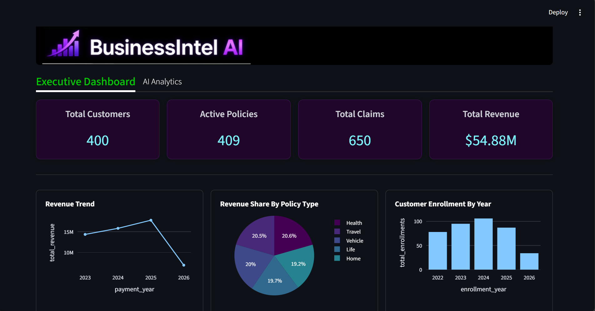
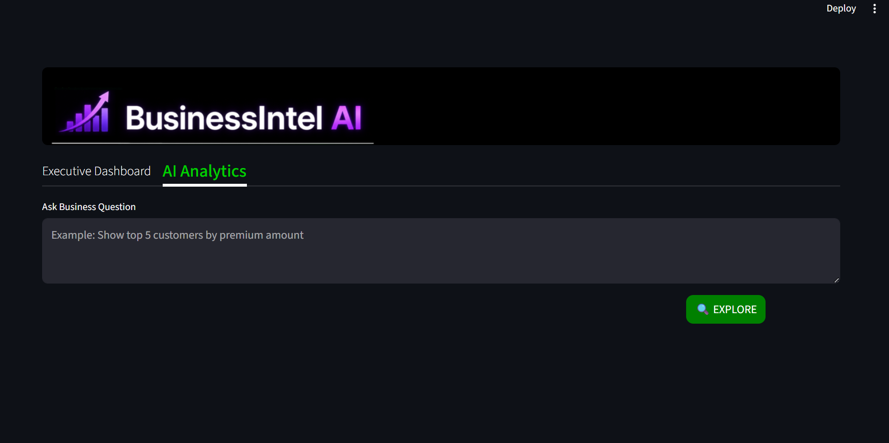
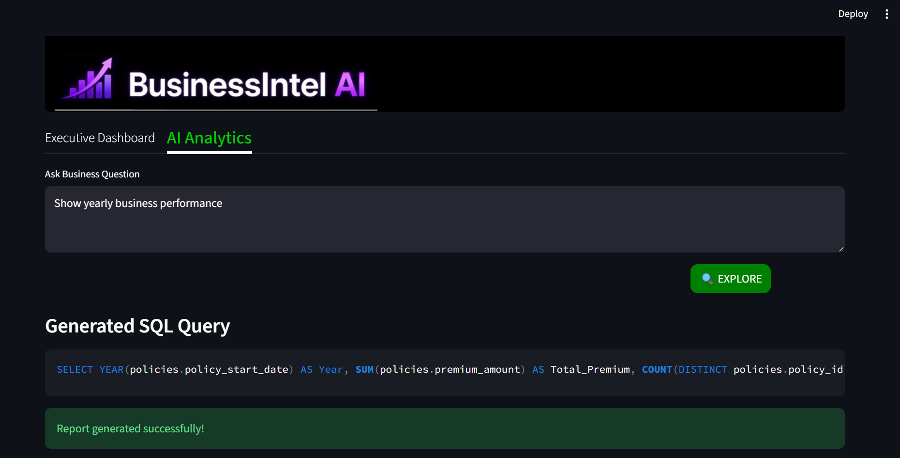
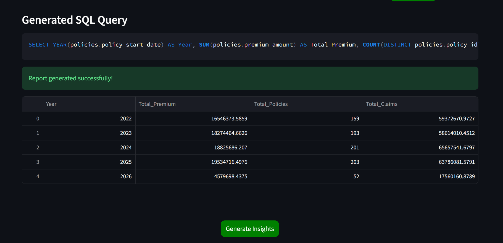
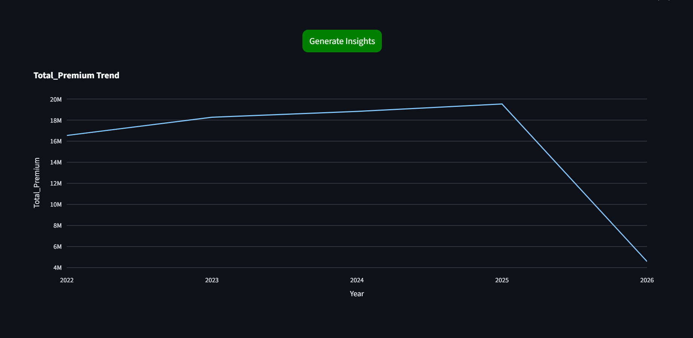
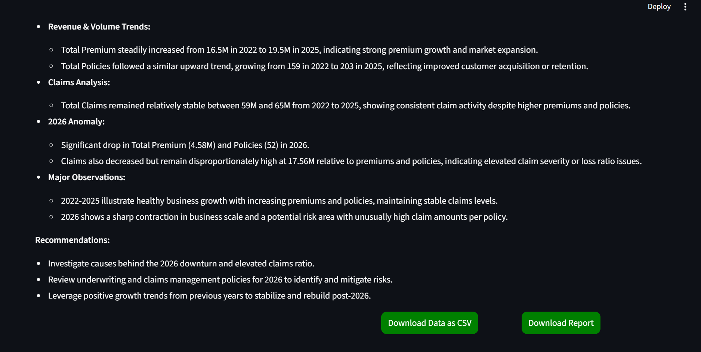

# BusinessIntel AI

AI-powered business intelligence and analytics platform for querying the database and generating 
- dashboards
- insights
- reports 
using natural language.

Built using Streamlit, SQL Server, Plotly, and OpenAI.

BusinessIntel AI allows users to:

* Ask business questions in natural language
* Automatically generate SQL queries using AI
* Execute queries on a SQL Server database
* Generate dynamic charts and dashboards
* Create AI-powered business insights from the queried data
* Download reports in CSV and PDF formats

---

# Features

## Executive Dashboard

* KPI Cards
* Revenue Trend Analysis
* Policy Distribution
* Claims Status Analytics
* Top Agents Performance

## AI Analytics

* Natural Language to SQL
* Dynamic Data Visualization
* AI Business Insights
* Interactive Charts

## Report Generation

* Download Query Results as CSV
* Download AI Analytics Report as PDF

---

# Tech Stack

## Frontend

* Streamlit
* HTML/CSS

## Backend

* Python
* SQL Server

## AI Integration

* OpenAI API - GPT-4 / GPT-4o

## Visualization

* Plotly

## PDF Reporting

* ReportLab
* Kaleido

---

# Application Flow

User Question  
→ AI SQL Generation  
→ SQL Execution  
→ Data Visualization  
→ AI Insights  
→ PDF Report Generation  

---

# Project Structure

```text
```text
BusinessIntel_AI/
│
├── assets/
│   ├── screenshots/
│   │   ├── ai_analytics_1.png
│   │   ├── ai_analytics_2.png
│   │   ├── ai_analytics_3.png
│   │   ├── ai_analytics_4.png
│   │   ├── ai_analytics_5.png
│   │   └── executive_dashboard.png
│   ├── banner_1.png
│   └── banner_2.png
│
├── logs/
│
├── prompts/
│   ├── insights_gen_prompt.txt
│   └── sql_prompt.txt
│
├── reports/
│
├── styles/
│   └── style.css
│
├── app.py
├── charts_generator.py
├── config.py
├── dashboard_charts.py
├── db_connector.py
├── insight_generator.py
├── kpi_generator.py
├── logger_config.py
├── query_generator.py
├── report_generator.py
├── utils.py
│
├── requirements.txt
├── README.md
└── .gitignore
```

---

# Installation

```bash
pip install -r requirements.txt
```

---

# Running The Application

```bash
streamlit run app.py
```

---

# Sample Business Questions

* Show yearly business performance
* Show top 5 customers by premium amount
* Show claim distribution by status
* Show revenue trend over years
* Show top performing agents
* Show policy distribution

---

# Screenshots

Screenshots of the UI:

## Executive Dashboard
### KPI cards


## AI Analytics

### AI Analytics UI


### AI Analytics results



### AI Analytics visualisations


AI Analytics Business Insights


---
# Demo Video

[](assets/demo/businessintel_ai_demo.mp4)

---
# Author

### Sandhya Rani Parida

---


