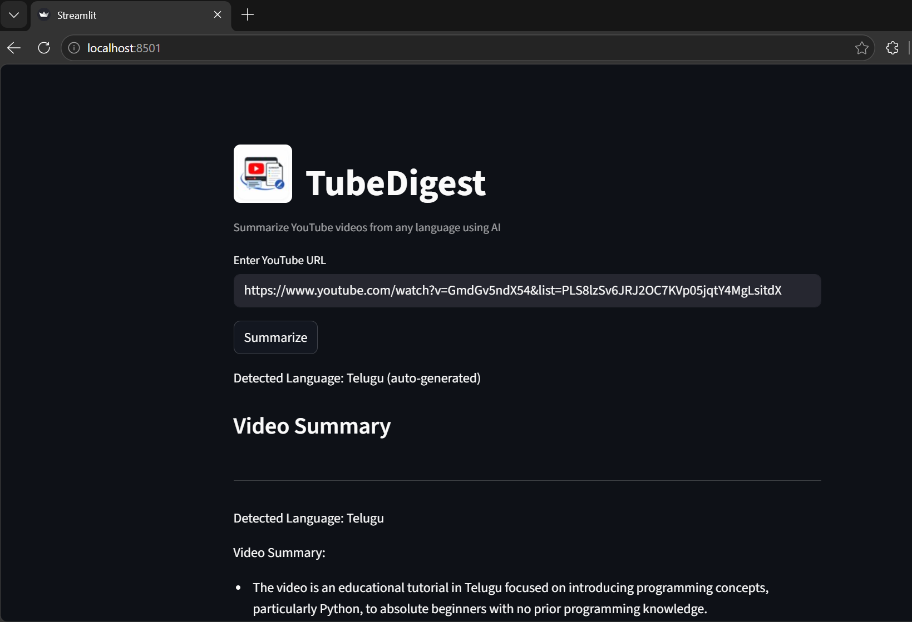

# TubeDigest 🎥

AI-powered multilingual YouTube video summarizer.

## Features

- Extracts YouTube transcripts
- Supports multiple languages
- Automatically translates transcripts to English
- Generates concise AI summaries
- Streamlit frontend UI

## Tech Stack

- Python
- Streamlit
- YouTube Transcript API
- Deep Translator
- Gemini/OpenAI API

## Installation

```bash
pip install -r requirements.txt
```

## Run the Project

```bash
streamlit run app.py
```

## Project Structure

```text
TubeDigest/
│
├── app.py
├── Youtube_video_summarizer.py
├── generate_transcript.py
├── requirements.txt
├── README.md
└── Screenshots/app-demo.png
```

## App Screenshot



## Future Improvements

- Generate summary from any language to any language

## Author
### Sandhya Rani Parida
